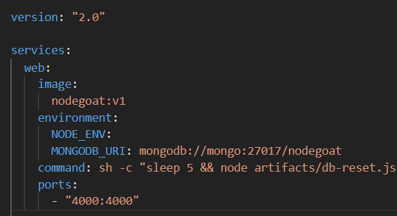

#### Copyright (c) 2020, 2021, Oracle and/or its affiliates.
#### Contributor: Trong Nhan Mai
---
# Build and Run Fuzzers in Docker containers

## OWASP ZAP (v2.9)
There is a Docker image available in Docker Hub. To be able to interact with the Node.js application, the image should run in the same network as the application.

To start OWASP ZAP with Web UI, run:

``` 
$ docker run --net <app_network> -u zap -p 8080:8080 -p 8090:8090 -i owasp/zap2docker-stable:2.9.0 zap-webswing.sh
```

Substitute `<app_network>` with the Docker network in which the Node.js application is running.

Then on your browser, head to http://localhost:8080/zap. Please see [ZAP Docker web UI guide](https://www.zaproxy.org/docs/docker/webswing/) for more information.


### **Example**
This section will demonstrate how a typical scanning session is carried out with OWASP ZAP on NodeGoat. (Some details might be different on your machine).

**1. Preparing a Docker image of NodeGoat**: 

Follow the instructions in [app_docker](../app_docker) to build the image. In this example, let image name of Nodegoat be `nodegoat:v1`.

**2. Starting up NodeGoat container with docker-compose**:

Replace the image name in the NodeGoat's `docker-compose.yml` file with `nodegoat:v1`. The result should be something like:



Then on your terminal, start it with:
```
$ docker-compose up
``` 

**3. Ensuring ZAP's container can interact with NodeGoat**

When NodeGoat is started with docker-compose, by default the container will be put in a Docker network (in this example the network is `nodegoat_default`). You can check the list of Docker networks by running:
```
$ docker network ls
```
And then inspect the Nodegoat network:
```
$ docker network inspect nodegoat_default
```
The result should have something similar to:


In this example, the IP address allocated to `nodegoat_web_1` (which is the NodeGoat container) is `172.18.0.2`. **When scanning with ZAP, this IP address is used as the target URL (i.e `http://172.18.0.2:4000`)**.

After NodeGoat container has been started properly, we need to start ZAP's container within that network for it to properly interact with NodeGoat. The command to startup ZAP in this example will be:
```
$ docker run --net nodegoat_default -u zap -p 8080:8080 -p 8090:8090 -i owasp/zap2docker-stable:2.9.0 zap-webswing.sh
```

After starting up ZAP's container, you can check the `nodegoat_default` network again by running:

```
$ docker network inspect nodegoat_default
```

If everything went right, the network will now have the ZAP's container included (ZAP container will have a random name generated by Docker - `naugthy_fermi`).


**4. Start scanning with ZAP**

 If you found the ZAP container within the NodeGoat network, it is possible for ZAP to interact with NodeGoat. The target URL (to access NodeGoat) thoughout this session will be `http://<nodegoat_container_IP>:4000`. Again, you can get the `nodegoat_container_IP` by inspecting `nodegoat_default` network with:
 ```
 $ docker network inspect nodegoat_default
 ```
 And check for `nodegoat_web_1` container.

***Step 1: Updating/installing necessary add-ons***
- Active scan rules (Release) - 37.0.0
- Active scan rules (Beta) - 32.0.0
- Active scan rules (Alpha) - 30.0.0
- Advanced SQL Injection Scanner (Beta) - 13.0.0
- Ajax Spider - 23.2.0

To update/install add-ons, from the `Help` tab go to `Check for Updates`.


More details on ZAP's add-ons can be found [here](https://www.zaproxy.org/addons/).

***Step 2: Importing the policies (used for scanning later on)*** 

Before crawling and scanning, the policy files must be imported (they are located at [zap_configs](./zap_configs)). To do that, from the `Analyze` tab go to `Scan Policy Manager` then click `Import`. This is the result:


Because we are importing file from our host machine, you will first need to use the white box at the bottom right corner to import the policy files into ZAP's container (policy files are located [here](./zap_configs)). After that, the file will be uploaded into ZAP's container and you can import it using `Scan Policy Manager` (in this case, using the `Open` near the top left corner of the image). 


After importing, it can be modified to fit your use cases. 

More information on ZAP's policy can be found [here](https://www.zaproxy.org/docs/desktop/start/features/scanpolicy/)

***Step 3: Run the crawler and scanner on Nodegoat***

To crawl Nodegoat, ZAP provides two tools: Spider and Ajax Spider. They are located in the `Tools` tab. These two Spiders require the target URL to work with. It is recommended to explore their options to fit your use cases.


More information can be found at [Spider](https://www.zaproxy.org/docs/desktop/start/features/spider/) and [Ajax Spider](https://www.zaproxy.org/docs/desktop/addons/ajax-spider/).

In the `Tools` tab, you can use `Active Scan` to perform scanning with those imported policies mentioned above. There are two necessary parameters for `Active Scan`:
- "Starting point": the starting point for the scan. You need to use `Active Scan` after crawling with ZAP's Spiders so that you can specify any starting point (for example: `http://<nodegoat_container_IP>:4000`). Or you can run `Active Scan` on any end points in the sitemap of `http://<nodegoat_container_IP>:4000` found in the left sidebar (given that you have already crawled NodeGoat). The site mape for Nodegoat will be similar to: 


- "Policy": Given that you have imported the policy configurations mentioned above, they will appear for you to choose. 

The image below show the window for starting up `Active Scanner`:


After setting all parameters, click `Start Scan` to perform the scan on the target with the specified policy.

***Step 4: Modifying request's header***

In case you want to modify the header of each request sent by ZAP to NodeGoat, ZAP provides "script" feature that allows you to do that. In this project, each HTTP request's header is included with authentication tokens (instructions on how to get the authentication tokens are located [here](../auth)). 

Click the following button on the main UI to create a new Script.


After that, there will be a list of available types of script. We are going to use `HTTP Sender`. Right click on `HTTP Sender` and click `New script`. Then set the values as follows:


After you save it, a `Script Console` will appear on the right hand side. This is where you can modify the script for your own use case. 


The image above show how the authentication token is included for NodeGoat. 

More information on ZAP's script can be found [here](https://www.zaproxy.org/docs/desktop/addons/script-console/).

Note: depends on the application that the header name will either be  `Cookie` (NodeGoat, Keystone, Mongo-express, apostrophe-boilerplate) or `Authorization` (JuiceShop). 

---
## Arachni (v1.5.1 with web UI v0.5.12)
To startup the Arachni Docker image (already available in Docker Hub), run:
```
docker run --net <app_network> -d -p 222:22 -p 7331:7331 -p 9292:9292 --name arachni arachni/arachni:1.5.1
```

The Web UI can be accessed from your browser at http://localhost:9292 


The default credentials when logging into the Web UI: 
1. Administrator account
- E-mail: admin@admin.admin
- Password: administrator

2. Regular user account
- E-mail: user@user.user
- Password: regular_user

The configuration file for Arachni scan are included in [arachni_configs](./arachni_configs). You must import these configuration files via Arahni's Web UI to be able to use them for scanning. 

**Importing the profile configuration** 

From the main UI after signing in, click `Profile` then click `Import`. Please modify the configuration accordingly (for example, the targeted web application IP address).

**Performing the scan**

From the main UI after signing in, click `Scan` then `New Scan`. In the return UI, you can set the target URL and the profile configuration. Given that you have already imported the profile, it will appear for you to choose. Then click `Go!` to start the scan.

Note: you can set the number of instances in `Advanced options` to suit your preference (during this project, 4 is set for this field).

---
## W3AF - v2019.1.2
Build from source:
```
$ git clone <w3af_repo>
$ cd W3AF
$ ./w3af/extras/docker/docker-build-local.sh 
```

It will build an image from source with the tag `andresriancho/w3af:source`

The `source` version of w3af used in this project is at commit [cd22e52](https://github.com/andresriancho/w3af/commit/cd22e5252243a87aaa6d0ddea47cf58dacfe00a9).

The original workflow of W3AF Docker image is to start it up and use SSH to connect to the running Docker container. However, the scripts to run this workflow in the repo does not work for me. Therefore, I decided to use `docker exec`.

This command will start up the W3AF container:
```
$ docker run --net <app_network> --name <container_name> -it -v ~/.w3af:/root/.w3af:z -v ~/w3af-shared:/root/w3af-shared:z -p 44444:44444 <w3af_image>
```

For `<w3af_image`, you can use:
- `andresriancho/w3af:latest` to use the latest release version on Docker Hub (which is quite out-of-date).
- `andresriancho/w3af:source` to use the image that you build using the instructions above.  

The startup command will start up 2 shared volumes (you can modify to fit your machine):
- `-v ~/.w3af:/root/.w3af:z`: `~/.w3af` in the host machine will be bind to `/root/.w3af` in the `w3af` container.
- `-v ~/w3af-shared:/root/w3af=shared:z`: `~/w3af-shared` in the host machine will be bind to `/root/w3af-shared` in the `w3af` container.

Instructions on how Docker volumes work can be found here [here](https://docs.docker.com/storage/volumes/#start-a-container-with-a-volume). 

When the container is running, one can start up the `w3af_console` by using:
```
$ docker exec -it <container_name> python /home/w3af/w3af/w3af_console --no-update
```

Or you can start a bash shell within the container by:
```
$ docker exec -it <container_name> /bin/bash 
```

The script to start the w3af console (`w3af_console`) is able to read the commands from a script. The scripts that I used to perform the scan in this project are located [here](./w3af_configs). 

To use the scripts, first copy them to the `w3af-shared` directory **in your host machine**. It will allow the `w3af` container to access them. After that, you can run the `w3af_console` with those script:

```
$ docker exec -it <container_name> python /home/w3af/w3af/w3af_console -s <location_to_script_from_w3af_container> --no-update
```  

Or this command from `bash` within the container:
```
$ /home/w3af/w3af/w3af_console -s <location_to_script_from_w3af_container> --no-update
```

**Important**:
- With those scripts, results will be generated in `/root/w3af-shared/<app_name>` of the `w3af` container, which you can access in `w3af-shared` of your host machine. 
- The scripts also utilize a `app_header.txt` to modify each HTTP request's header. The file will "`<Header_name>: <vakue>`" which you will use to include the authentication token for each application. According to the scripts, `w3af_console` will access `app_headers.txt` at `/root/w3af-shared/<app_name/app_headers.txt` in the w3af container (you will have to put `app_header.txt` in `w3af-shared` of your host machine).
- You must update the URLs in those scripts to suit your environment setup (you can check the app container's IP by running `docker network inspect <app_network>`). 
- You can also change the paths values in those w3af scripts to fit your use case.